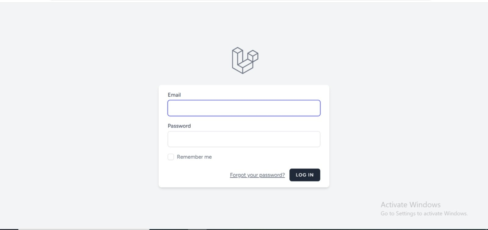
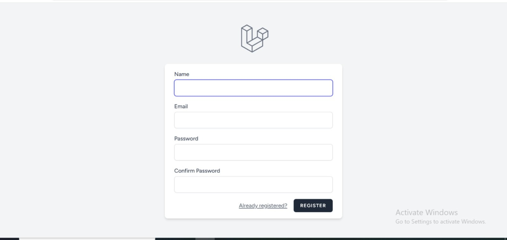
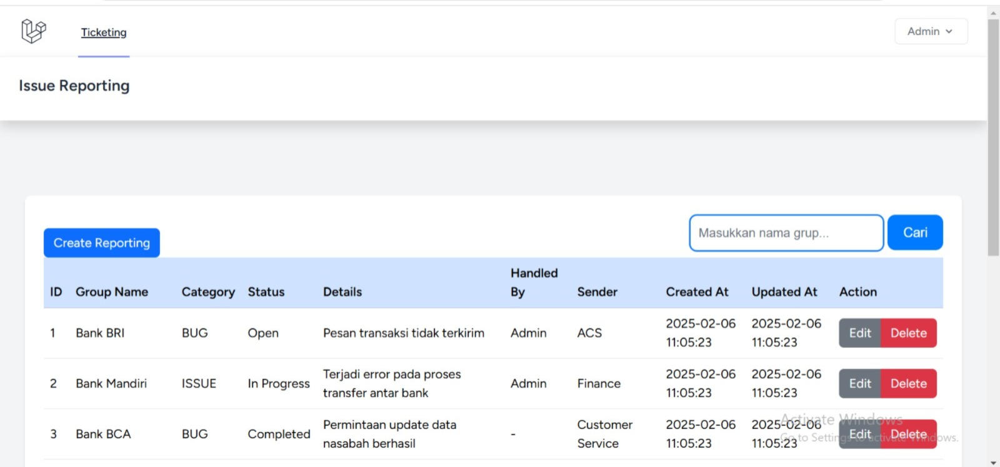
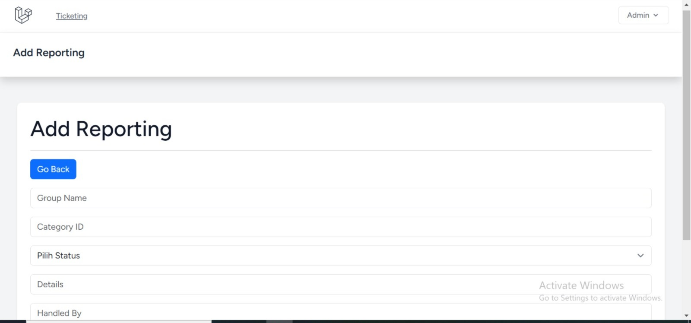
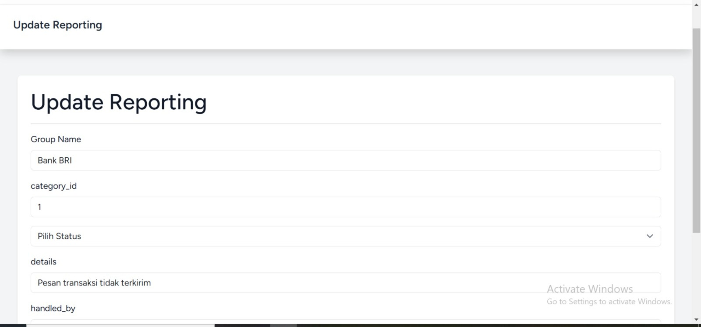
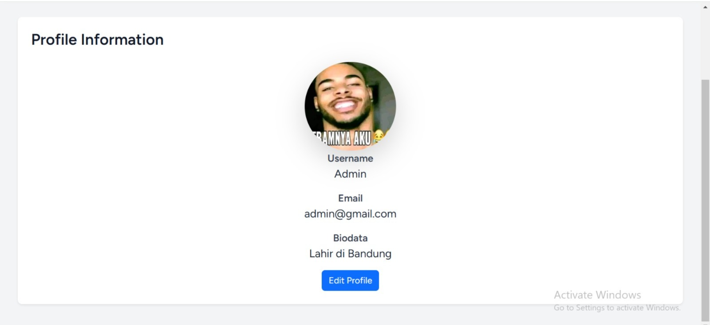
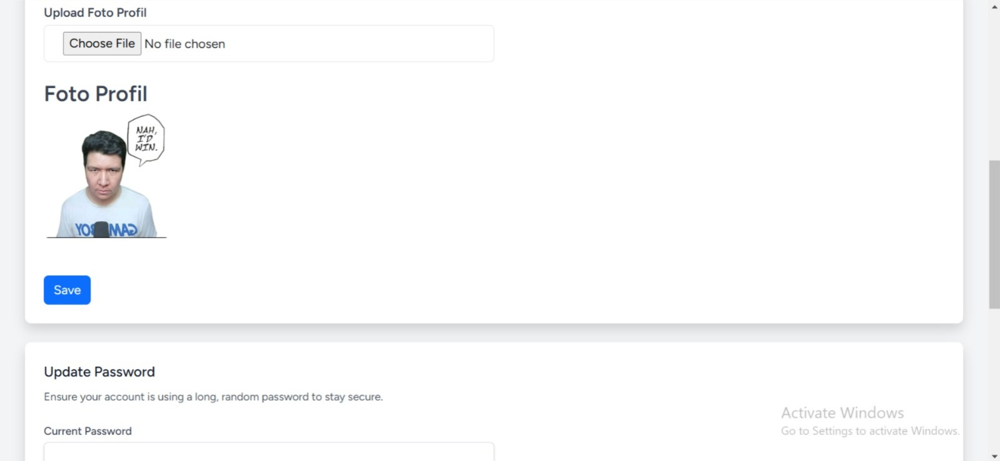

# Project ticketing (Laravel 11 & Breeze)

## Awalan 
Proyek ini merupakan sistem ticketing berebasis Laravel 11 dengan Autentikasi dan Breeze

## Fitur
- Login & Registar
- Role
- CRUD
- Profile
- Logout

## Yang dibutuhkan
- PHP 8.2 atau lebih
- Composer
- Node.js & npm
- MySQL
- GitBash

## Instalasi
'''GitBash''
- git clone https://github.com/imarcellz/Ticketing.git

- cd Ticketing

- npm install & npm run build

## Konfigurasi
1. Ubah file '.env' sesuaikan dengan pengaturan Anda
2. Jalankan peintah berikut untuk migrasi database.
''Terminal powershell
php artisan migrate''

## Tampilan

### Login

### Register

### Ticketing

### Create Ticket

### Edit Ticket

### Profile

### Edit Profile && Pasword

